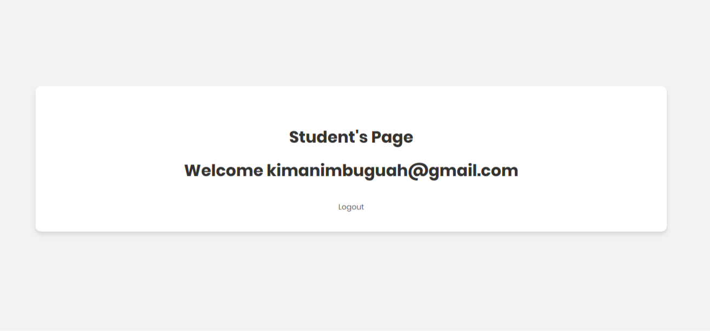

# Simple Role Based Login System

Login Page


Invalid Credentials


Admin's Page


Student's Page


## Installation

Invalidate Sessions


Windows, OS X & Linux:

```sh
run on any development/production server
```


## Release History

* 1.0
    * CHANGE: User Interface design

## Meta

Kimani Mbugua – kimanimbuguah@gmail.com

[https://github.com/kimani-mbuguah/proxi](https://github.com/kimani-mbuguah/)