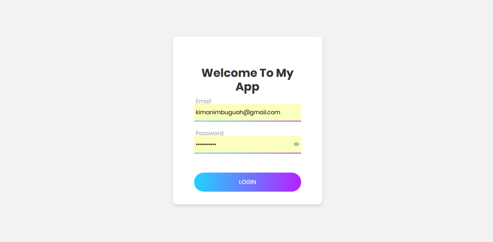
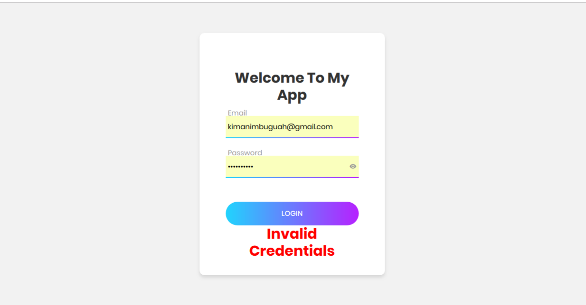
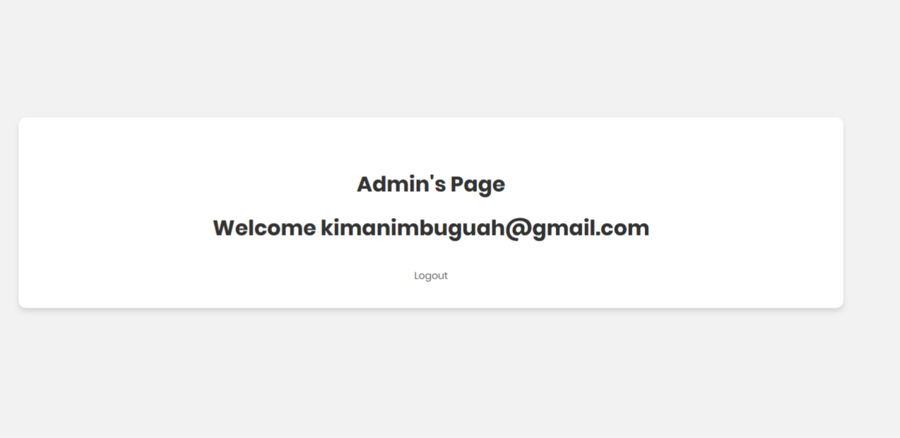
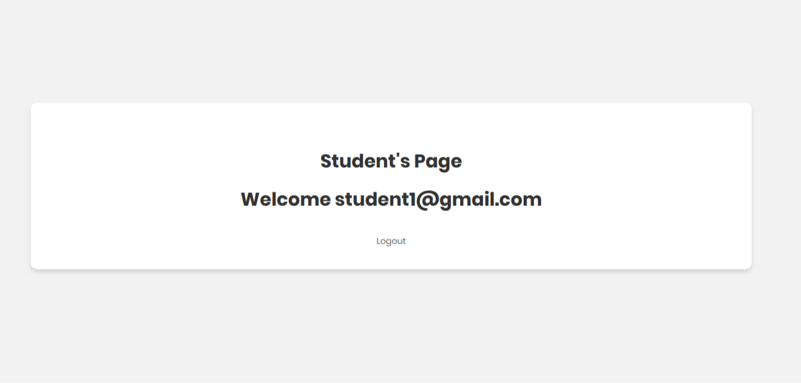
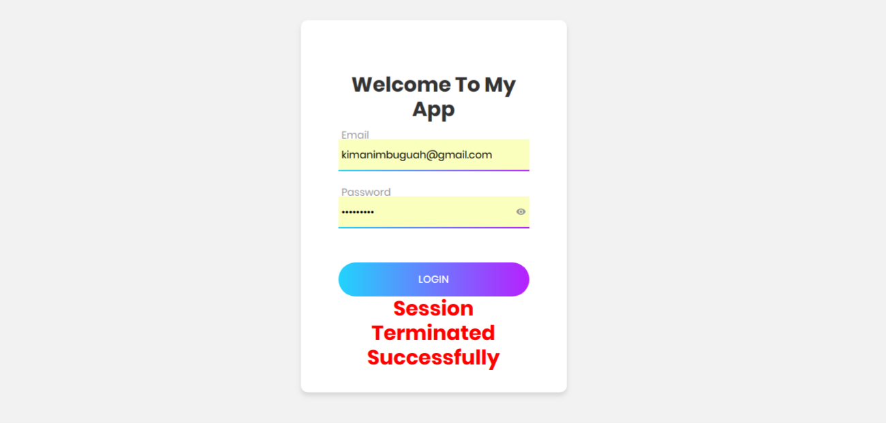

# Simple Role Based Login System

Login Page



Invalid Credentials



Admin's Page



Student's Page




Invalidate Sessions



## Installation

Windows, OS X & Linux:

```sh
run on any development/production server
```


## Release History

* 1.0
    * CHANGE: Simple java role based login system

## Author

Kimani Mbugua – kimanimbuguah@gmail.com
